# 🏆 AI MathMate — AIME 2025 I 원형 vs 변형 비교 분석 리포트

> **생성 엔진:** amc_engine (GPT-4o-mini)  
> **원형 출처:** [AIME 2025 I, AoPS](https://artofproblemsolving.com/wiki/index.php/2025_AIME_I_Problems)  
> 각 문항별 원형 문제 1개 + AI 생성 변형 3개를 비교합니다.

---

## 📌 P01 — Problem 1 — Number Theory (Base Representations)

- **주제:** Number Theory / Divisibility in Base $b$
- **난이도:** AIME Level 1

### 🔵 원형 문제 (Official AIME 2025 I)

> Find the sum of all integer bases $b > 1$ for which $17_b$ is a divisor of $97_b$.

**🔑 공식 정답: `70`**

---

### 🟢 실전 변형 문제 (MOCK) (3개)

#### 실전 변형 1

> Determine the sum of all integer bases $b > 9$ such that the number $15_b$ is a divisor of the number $99_b$.

**🔑 답: `44`** &nbsp;|&nbsp; 🌱 시드: `X=9, Y=5, W=9` &nbsp;|&nbsp; 🎨 테마: `Direct`

#### 실전 변형 2

> Determine the sum of all integer bases $b > 8$ such that the number $17_b$ is a divisor of the number $86_b$.

**🔑 답: `61`** &nbsp;|&nbsp; 🌱 시드: `X=8, Y=7, W=6` &nbsp;|&nbsp; 🎨 테마: `Style 1 (Direct)`

#### 실전 변형 3

> Find the sum of all integer bases $b > 13$ for which the value represented by the digits CA in base $b$ is a multiple of the value represented by the digits 1D in base $b$.

**🔑 답: `193`** &nbsp;|&nbsp; 🌱 시드: `X=12, Y=13, W=10` &nbsp;|&nbsp; 🎨 테마: `Style 2 (Digits)`

### 🛠️ 개념 드릴 문제 (DRILL)

#### 드릴 Level 3

> In a futuristic civilization that relies on the transmission of Quantum Data Packets, a significant quantity is represented in base-$b$ notation as $77_{b}$. The system is designed to ensure that this quantity can be perfectly divided into smaller packets of size $1D_{b}$, where $D$ is a constant determined by the operational parameters of the civilization. Due to technological constraints, it is required that the base $b$ be greater than 13. Determine the sum of all possible valid integer values for the base $b$ that meet these criteria.

**🔑 답: `115.0`** &nbsp;|&nbsp; 🌱 시드: `X=7, Y=13, W=7` &nbsp;|&nbsp; 🎨 테마: `Modeling`

#### 드릴 Level 2

> Find the smallest integer base $b > 11$ such that the base-$b$ number $B9_b$ is divisible by the base-$b$ number $17_b$.

**🔑 답: `27.0`** &nbsp;|&nbsp; 🌱 시드: `X=11, Y=7, W=9` &nbsp;|&nbsp; 🎨 테마: `Standard`

#### 드릴 Level 3

> In an ancient civilization, the inhabitants utilized a mysterious numerical parameter denoted as $b$, which represented their number base. They had a substantial quantity represented in their unique notation as $8E_{b}$. In order to fulfill their societal needs, this quantity had to be divided into smaller sections, each sized $1D_{b}$. However, the parameters of their advanced system dictated that $b$ must be greater than 14. Determine the sum of all possible valid integer values for the parameter $b$.

**🔑 답: `126.0`** &nbsp;|&nbsp; 🌱 시드: `X=8, Y=13, W=14` &nbsp;|&nbsp; 🎨 테마: `Thematic Mathematical Modeling`

#### 드릴 Level 2

> Find the smallest integer base $b > 12$ such that the base-$b$ number $C3_b$ is divisible by the base-$b$ number $1B_b$.

**🔑 답: `32.0`** &nbsp;|&nbsp; 🌱 시드: `X=12, Y=11, W=3` &nbsp;|&nbsp; 🎨 테마: `Algebra`

#### 드릴 Level 3

> In a distant galaxy, an advanced civilization relies on a numerical parameter $b$ to communicate securely. Their cryptic messages are encoded using a base-$b$ system, where the large quantity is represented as $B3_{b}$. This quantity must be perfectly divisible into smaller segments of size $16_{b}$, crucial for their data transmission protocols. Given that $b$ must be greater than 11, determine the sum of all possible valid integer values for the parameter $b$ that satisfy this condition.

**🔑 답: `72.0`** &nbsp;|&nbsp; 🌱 시드: `X=11, Y=6, W=3` &nbsp;|&nbsp; 🎨 테마: `Thematic`

#### 드릴 Level 1

> Find the base-10 value of the number $A2_{14}$ represented in base $14$.

**🔑 답: `142.0`** &nbsp;|&nbsp; 🌱 시드: `X=10, Y=4, W=2` &nbsp;|&nbsp; 🎨 테마: `Drill`

#### 드릴 Level 1

> Find the base-10 value of the number $82_{13}$ represented in base $13$.

**🔑 답: `106.0`** &nbsp;|&nbsp; 🌱 시드: `X=8, Y=8, W=2` &nbsp;|&nbsp; 🎨 테마: `Basic Calculation`

#### 드릴 Level 2

> Find the smallest integer base $b > 14$ such that the base-$b$ number $93_b$ is divisible by the base-$b$ number $1E_b$.

**🔑 답: `27.0`** &nbsp;|&nbsp; 🌱 시드: `X=9, Y=14, W=3` &nbsp;|&nbsp; 🎨 테마: `direct computation`

#### 드릴 Level 1

> Find the base-10 value of the number $68_{13}$ represented in base $13$.

**🔑 답: `86.0`** &nbsp;|&nbsp; 🌱 시드: `X=6, Y=9, W=8` &nbsp;|&nbsp; 🎨 테마: `Direct computation`

#### 드릴 Level 3

> In a futuristic network routing system, a civilization relies on a numerical parameter $b$ that defines the base of their number system. They represent a large quantity of data as $AC_{b}$ in base-$b$ notation. For efficient routing, this data must be perfectly divisible into smaller packets of size $15_{b}$, also expressed in base-$b$. Given that the parameter $b$ must be greater than 12 due to system constraints, determine the sum of all possible valid integer values for the parameter $b$.

**🔑 답: `47.0`** &nbsp;|&nbsp; 🌱 시드: `X=10, Y=5, W=12` &nbsp;|&nbsp; 🎨 테마: `Mathematical Modeling`

---

## 📌 P10 — Problem 10 — Combinatorics / Grid Arrangements (Sudoku)

- **주제:** Combinatorics
- **난이도:** AIME Level 10

### 🔵 원형 문제 (Official AIME 2025 I)

> The 27 cells of a $3 \times 9$ grid are filled in using the numbers $1$ through $9$ so that each row contains $9$ different numbers, and each of the three $3 \times 3$ blocks contains $9$ different numbers, as in the first three rows of a Sudoku puzzle. The number of different ways to fill such a grid can be written as $p^a \cdot q^b \cdot r^c \cdot s^d$ where $p, q, r, s$ are distinct prime numbers and $a,b,c,d$ are positive integers. Find $p \cdot a + q \cdot b + r \cdot c + s \cdot d$.

**🔑 공식 정답: `81`**

---

### 🟢 실전 변형 문제 (MOCK) (3개)

#### 실전 변형 1

> Consider a $3 \times 3K$ grid that is partitioned into three $3 \times K$ blocks. Each row of the grid must be a permutation of the numbers $1$ to $3K$, and within each $3 \times K$ block, the numbers must also be a permutation of $1$ to $3K$. Determine the number of distinct ways to fill this grid.

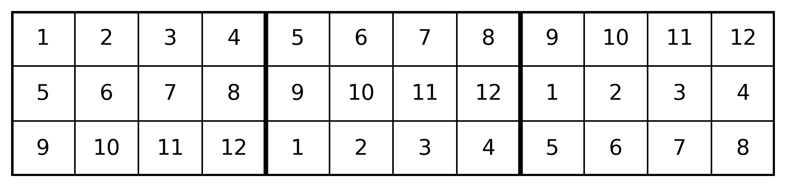

**🔑 답: `292`** &nbsp;|&nbsp; 🌱 시드: `K=4, M=None` &nbsp;|&nbsp; 🎨 테마: `Permutations, Block Distribution, Franel numbers`

#### 실전 변형 2

> Consider a $3 \times 3K$ grid divided into three $3 \times K$ blocks. The grid must be filled with the integers from $1$ to $3K$ such that each row is a permutation of the integers $1$ to $3K$, and each $3 \times K$ block is also a permutation of the integers $1$ to $3K$. How many distinct ways can the grid be filled under these constraints?

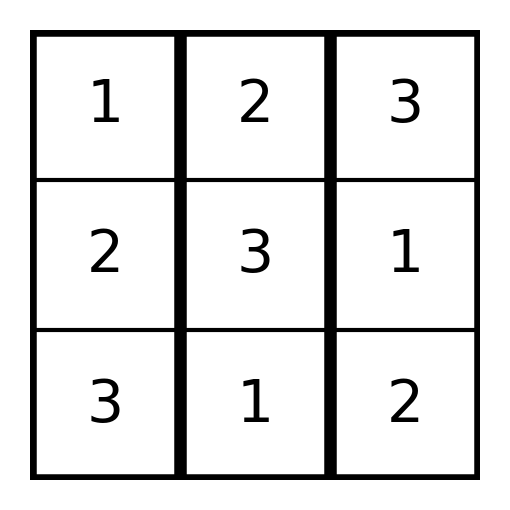

**🔑 답: `7`** &nbsp;|&nbsp; 🌱 시드: `K=1, M=None` &nbsp;|&nbsp; 🎨 테마: `Grid Distribution`

#### 실전 변형 3

> Consider a $3 \times 3K$ grid that is divided into three $3 \times K$ blocks. Each row of the grid must be a permutation of the numbers $1, 2, \ldots, 3K$, and each of the three blocks must also consist of permutations of the same set of numbers. Determine the number of ways to fill this grid under the given conditions.

**🔑 답: `744`** &nbsp;|&nbsp; 🌱 시드: `K=5, M=None` &nbsp;|&nbsp; 🎨 테마: `Permutations and Block Distribution`

### 🛠️ 개념 드릴 문제 (DRILL)

#### 드릴 Level 3

> At a university, there are 9 students who need to be assigned to 3 different course tracks: Science, Arts, and Engineering. This assignment process happens over 3 phases, where each phase corresponds to a different week. During each week, every course track must receive exactly 3 students from the total pool of 9 students. The crucial rule is that no student can attend the same course track more than once throughout the entire assignment process. Given that each course track must maintain a balanced representation from the total pool of students, find the total number of valid arrangements for assigning the students across the 3 phases. Finally, find the remainder when the total number of valid ways is divided by 1000.

**🔑 답: `680.0`** &nbsp;|&nbsp; 🌱 시드: `K=3, M=None` &nbsp;|&nbsp; 🎨 테마: `Real-world scenario`

#### 드릴 Level 3

> In a bustling kitchen, a head chef is preparing for a grand banquet and needs to allocate special ingredients to different chef stations. There are 6 unique ingredients: A, B, C, D, E, and F. These ingredients must be distributed among 3 chef stations: Station 1, Station 2, and Station 3 over 3 preparation phases. In each phase, the stations must evenly divide all 6 ingredients such that each station receives exactly 2 ingredients from the initial set of ingredients. Importantly, over the course of the 3 phases, no ingredient can visit the same station more than once. How many valid arrangements are possible for the distribution of the ingredients among the stations?

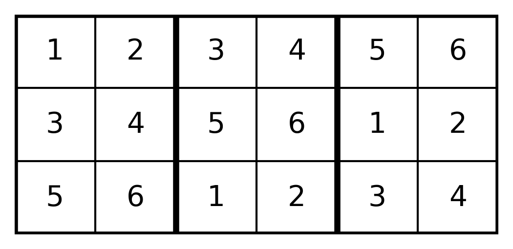

**🔑 답: `460800.0`** &nbsp;|&nbsp; 🌱 시드: `K=2, M=None` &nbsp;|&nbsp; 🎨 테마: `real-world scenario`

#### 드릴 Level 3

> Consider a $3 \times 3K$ grid that is divided into three $3 \times K$ blocks. Each row of the grid must be filled with the numbers from $1$ to $3K$, such that every row is a permutation of these numbers. Additionally, each $3 \times K$ block must also contain all the numbers from $1$ to $3K$ as a permutation. Determine the number of distinct ways to fill this grid satisfying the given conditions.

**🔑 답: `948109639680.0`** &nbsp;|&nbsp; 🌱 시드: `K=3, M=None` &nbsp;|&nbsp; 🎨 테마: `Permutations, Block Distribution, Franel numbers`

#### 드릴 Level 3

> Consider a $3 \times 3K$ grid that is partitioned into three $3 \times K$ blocks. Each row of the grid must be a permutation of the integers from $1$ to $3K$. Additionally, each $3 \times K$ block must also contain a permutation of the integers from $1$ to $3K$. Determine the number of distinct ways to fill this grid under the given constraints.

**🔑 답: `460800.0`** &nbsp;|&nbsp; 🌱 시드: `K=2, M=None` &nbsp;|&nbsp; 🎨 테마: `Permutations and Block Distribution`

#### 드릴 Level 3

> Determine the number of ways to fill a $3 \times 3K$ grid using the integers $1$ to $3K$ such that each row is a permutation of $1$ to $3K$, and each of the three $3 \times K$ blocks contains a permutation of the same integers. The solution involves evaluating factorials and the sum of cubes of binomial coefficients.

**🔑 답: `948109639680.0`** &nbsp;|&nbsp; 🌱 시드: `K=3, M=None` &nbsp;|&nbsp; 🎨 테마: `Permutations, Block Distribution, Franel numbers`

#### 드릴 Level 3

> Consider a $3 \times 3K$ grid that is partitioned into three $3 \times K$ blocks. The objective is to fill this grid using the numbers $1$ to $3K$ such that each row of the grid forms a permutation of the numbers $1$ to $3K$, and each $3 \times K$ block also forms a permutation of the numbers $1$ to $3K$. Determine the total number of ways to fill the grid following these rules.

**🔑 답: `460800.0`** &nbsp;|&nbsp; 🌱 시드: `K=2, M=None` &nbsp;|&nbsp; 🎨 테마: `Permutations, Block Distribution, Franel numbers`

#### 드릴 Level 3

> Consider a $3 \times 3K$ grid, where $K$ is a positive integer. The grid is divided into three $3 \times K$ blocks. Each row of the grid must be a permutation of the numbers $1$ to $3K$, and each $3 \times K$ block must also contain each number from $1$ to $3K$ exactly once. Determine the number of distinct ways to fill this grid according to these constraints.

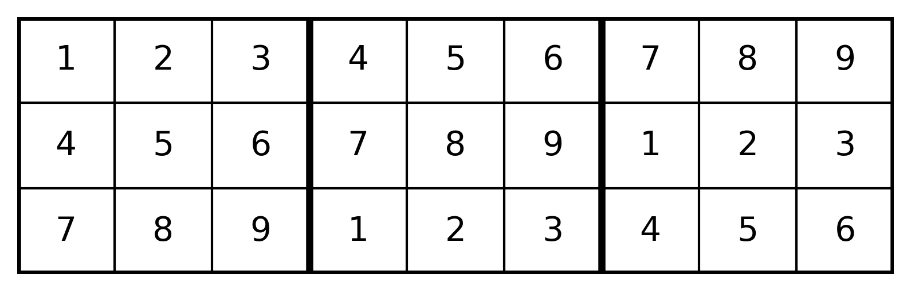

**🔑 답: `948109639680.0`** &nbsp;|&nbsp; 🌱 시드: `K=3, M=None` &nbsp;|&nbsp; 🎨 테마: `Grid Arrangement`

#### 드릴 Level 2

> Consider a $3 \times 3K$ grid that is divided into three $3 \times K$ blocks. The objective is to fill this grid using the numbers $1$ to $3K$ such that each row is a permutation of the numbers $1$ to $3K$, and each $3 \times K$ block is also a permutation of the numbers $1$ to $3K$. Determine the number of valid ways to fill the grid.

**🔑 답: `12.0`** &nbsp;|&nbsp; 🌱 시드: `K=1, M=None` &nbsp;|&nbsp; 🎨 테마: `Block distribution and permutations`

#### 드릴 Level 2

> Consider a $3 \times 3K$ grid where $K$ is a positive integer. This grid is partitioned into three $3 \times K$ blocks. Each row of the grid must contain the numbers $1$ to $3K$ exactly once, forming a permutation in each row. Additionally, each $3 \times K$ block must also be a permutation of the numbers $1$ to $3K$. Determine the total number of ways to fill this grid under these conditions.

**🔑 답: `12.0`** &nbsp;|&nbsp; 🌱 시드: `K=1, M=None` &nbsp;|&nbsp; 🎨 테마: `Permutations and Block Distribution`

#### 드릴 Level 2

> Consider a grid of size $3 \times 3K$ that is partitioned into three blocks of size $3 \times K$. Each row of the grid must contain a permutation of the integers from $1$ to $3K$, and each block must also contain a permutation of the integers from $1$ to $3K$. Determine the number of ways to fill the grid under these conditions.

**🔑 답: `12.0`** &nbsp;|&nbsp; 🌱 시드: `K=1, M=None` &nbsp;|&nbsp; 🎨 테마: `Counting`

---

## 📌 P11 — Problem 11 — Functions / Geometric Intersections (Piecewise Parabola)

- **주제:** Algebra / Functions
- **난이도:** AIME Level 11

### 🔵 원형 문제 (Official AIME 2025 I)

> A piecewise linear function $f$ is defined by $f(x) = x$ if $-1 \le x < 1$, and $f(x) = 2 - x$ if $1 \le x < 3$. Let $f(x + 4) = f(x)$ for all real numbers $x$. The parabola $x = 34y^2$ intersects the graph of $f(x)$ at finitely many points. The sum of the $y$-coordinates of all these intersection points can be expressed in the form $\frac{a + b\sqrt{c}}{d}$, where $c$ is squarefree. Find $a+b+c+d$.

**🔑 공식 정답: `259`**

---

### 🟢 실전 변형 문제 (MOCK) (3개)

#### 실전 변형 1

> Consider the periodic sawtooth function defined by \( f(x) = x - \lfloor x \rfloor \) for all real numbers \( x \). This function oscillates between \( 0 \) and \( 1 \) with a period of \( 1 \). Additionally, consider the forward-opening parabola defined by \( x = Ky^2 \) for some positive constant \( K \). Find the sum of the \( y \)-coordinates of all intersection points between the function \( f(x) \) and the parabola. Express your answer in the form \( \frac{a + b\sqrt{c}}{d} \), where \( a, b, c, \) and \( d \) are integers.

**🔑 답: `259`** &nbsp;|&nbsp; 🌱 시드: `K=34, M=None` &nbsp;|&nbsp; 🎨 테마: `AIME`

#### 실전 변형 2

> Let the sawtooth function \( f(x) \) be defined as follows: \( f(x) = x - \lfloor x \rfloor \) for \( x \geq 0 \). Consider the parabola given by \( x = Ky^2 \) where \( K \) is a positive constant. Find the sum of the \( y \)-coordinates of all intersection points between the function \( f(x) \) and the parabola \( x = Ky^2 \). Express your answer in the form \( \frac{a + b\sqrt{c}}{d} \), where \( a, b, c, \) and \( d \) are integers.

**🔑 답: `801`** &nbsp;|&nbsp; 🌱 시드: `K=7, M=None` &nbsp;|&nbsp; 🎨 테마: `AIME`

#### 실전 변형 3

> Let the piecewise sawtooth function be defined as follows: $$f(x) = \begin{cases} x - 2n & \text{if } 2n \leq x < 2n + 2, \ n \in \mathbb{Z} \\ 2n + 2 - x & \text{if } 2n + 2 \leq x < 2n + 4, \ n \in \mathbb{Z} \end{cases}$$. Consider the parabola given by the equation $$x = Ky^2$$ for some constant $K > 0$. Find the sum of the $y$-coordinates of all intersection points between the function $f(x)$ and the parabola $x = Ky^2$.

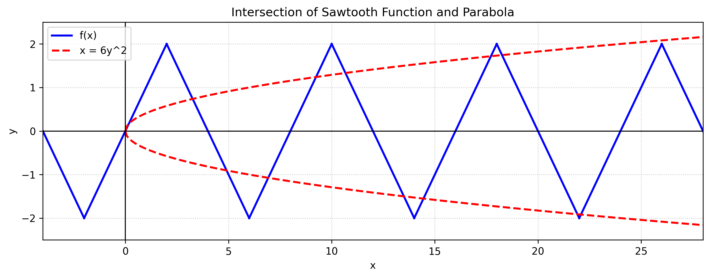

**🔑 답: `578`** &nbsp;|&nbsp; 🌱 시드: `K=6, M=None` &nbsp;|&nbsp; 🎨 테마: `AIME`

### 🛠️ 개념 드릴 문제 (DRILL)

#### 드릴 Level 3

> A periodic linear signal $f(x)$ is defined with the following properties: its peak amplitude is $2$, its period is $8$, and it follows the linear segments $f(x) = x$ for $x \in [-2, 2]$ and $f(x) = 4 - x$ for $x \in [2, 6]$. This signal is monitored by a parabolic sensor shaped like $x = 7y^2$. The intersections of the signal and the sensor represent key data points. Calculate the sum of the $y$-coordinates of all intersection points of the signal and the sensor. Express your final answer in the form $\frac{a + b \sqrt{c}}{d}$, and compute $a + b + c + d$.

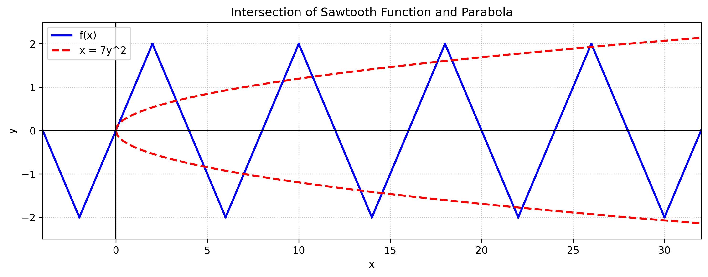

**🔑 답: `801.0`** &nbsp;|&nbsp; 🌱 시드: `K=7, M=None` &nbsp;|&nbsp; 🎨 테마: `Modeling`

#### 드릴 Level 2

> Define the periodic function $f$ as follows: \[ f(x) = \begin{cases} x & \text{if } -2 \le x < 2 \ 4 - x & \text{if } 2 \le x < 6 \end{cases} \] with the periodicity condition $f(x + 8) = f(x)$ for all real numbers $x$. Solve the equation $f(x) = 0.6$ and find the sum of all solutions $x$ in the interval $[0, 24]$.

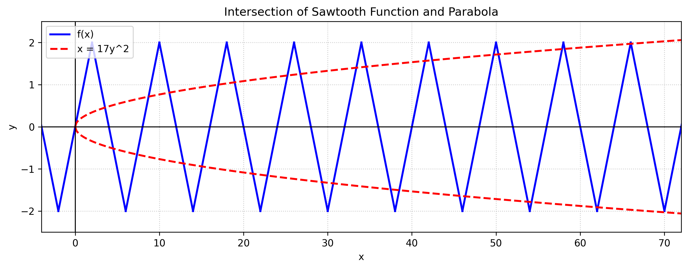

**🔑 답: `60.0`** &nbsp;|&nbsp; 🌱 시드: `K=17, M=None` &nbsp;|&nbsp; 🎨 테마: `Equation Solving`

#### 드릴 Level 1

> Let the function $f(x)$ be defined as follows: $$f(x) = \begin{cases} x & \text{if } -1 \le x < 1 \\ 2 - x & \text{if } 1 \le x < 3 \end{cases}$$ and $$f(x + 4) = f(x)$$ for all real numbers $x$. Evaluate $f(29)$. 

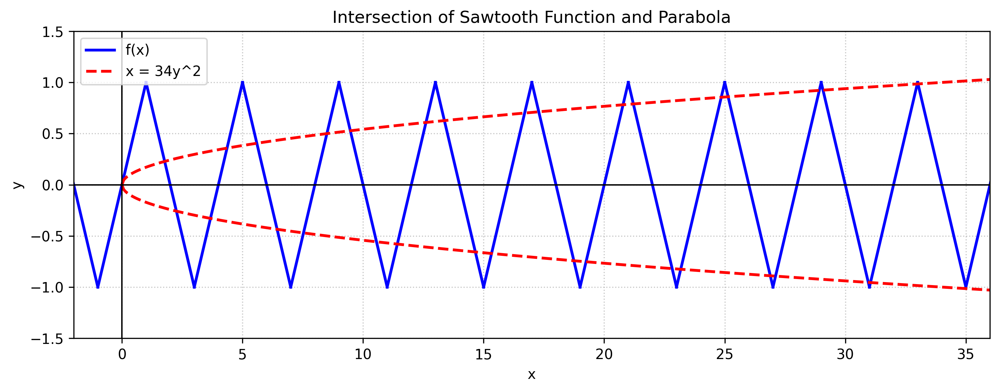

**🔑 답: `1.0`** &nbsp;|&nbsp; 🌱 시드: `K=34, M=None` &nbsp;|&nbsp; 🎨 테마: `Direct Calculation`

#### 드릴 Level 3

> A periodic linear signal $f(x)$ is defined as follows: it has a peak amplitude of $2$, a period of $8$, and follows the linear segments: $f(x) = x$ for $x \in [-2, 2]$ and $f(x) = 4 - x$ for $x \in [2, 6]$. This signal is monitored by a parabolic sensor described by the equation $x = 7y^2$. The intersections of the signal and the sensor represent key data points for analysis. Find the sum of the $y$-coordinates of all intersection points of the signal and the sensor, and express your answer in the form $\frac{a + b\sqrt{c}}{d}$, where $a$, $b$, $c$, and $d$ are integers. Finally, compute $a + b + c + d$.

**🔑 답: `801.0`** &nbsp;|&nbsp; 🌱 시드: `K=7, M=None` &nbsp;|&nbsp; 🎨 테마: `Modeling`

#### 드릴 Level 2

> Consider the periodic function defined as follows: \( f(x) = \begin{cases} x & \text{if } -2 \le x < 2 \\ 4 - x & \text{if } 2 \le x < 6 \end{cases} \) and \( f(x + 8) = f(x) \) for all real numbers \( x \). Solve the equation \( f(x) = 1.6 \) and find the sum of all solutions \( x \) in the interval \( [0, 24] \).

**🔑 답: `60.0`** &nbsp;|&nbsp; 🌱 시드: `K=17, M=None` &nbsp;|&nbsp; 🎨 테마: `Direct Calculation`

#### 드릴 Level 1

> Evaluate $f(42)$ where the function $f(x)$ is defined as follows: $f(x) = x$ if $-2 \le x < 2$, $f(x) = 4 - x$ if $2 \le x < 6$, and $f(x + 8) = f(x)$ for all real numbers $x$.

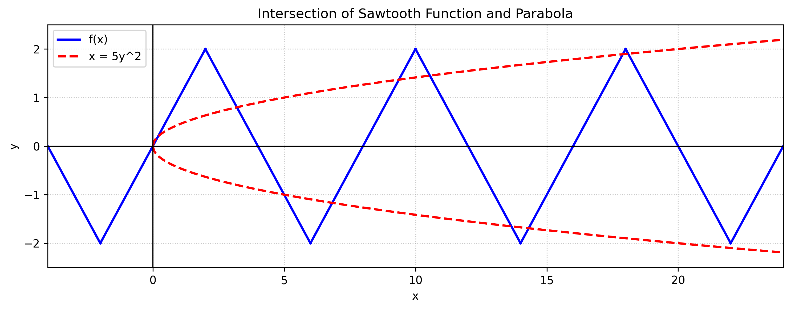

**🔑 답: `2.0`** &nbsp;|&nbsp; 🌱 시드: `K=5, M=None` &nbsp;|&nbsp; 🎨 테마: `Direct Calculation`

#### 드릴 Level 3

> A periodic linear signal $f(x)$ defined over the interval $[-2, 6]$ has a peak amplitude of $2$ and a period of $8$. Its expression is given by \( f(x) = x \) for \( x \in [-2, 2] \) and \( f(x) = 4 - x \) for \( x \in [2, 6] \). This signal is monitored by a parabolic sensor shaped like \( x = 17y^2 \). To analyze the behavior of the signal, determine the intersection points between the signal and the sensor. Find the sum of the $y$-coordinates of all these intersection points, expressed in the form \( \frac{a + b\sqrt{c}}{d} \), and compute the final answer as \( a + b + c + d \).

**🔑 답: `225.0`** &nbsp;|&nbsp; 🌱 시드: `K=17, M=None` &nbsp;|&nbsp; 🎨 테마: `Modeling`

#### 드릴 Level 2

> Consider the periodic function defined as follows: $f(x) = \begin{cases} x & \text{if } -2 \leq x < 2 \\ 4 - x & \text{if } 2 \leq x < 6 \end{cases}$, with the property that $f(x + 8) = f(x)$ for all real numbers $x$. Solve the equation $f(x) = 1.5$ and find the sum of all solutions $x$ in the interval $[0, 24]$.

**🔑 답: `60.0`** &nbsp;|&nbsp; 🌱 시드: `K=7, M=None` &nbsp;|&nbsp; 🎨 테마: `Direct Application`

#### 드릴 Level 1

> Let the function $f(x)$ be defined as follows: $$f(x) = \begin{cases} x & \text{if } -1 \le x < 1 \\ 2 - x & \text{if } 1 \le x < 3 \end{cases}$$ and $f(x + 4) = f(x)$ for all real numbers $x$. Evaluate $f(31)$. 

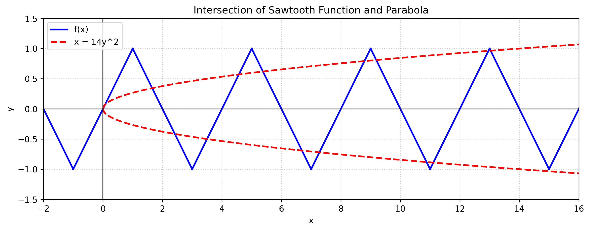

**🔑 답: `-1.0`** &nbsp;|&nbsp; 🌱 시드: `K=14, M=None` &nbsp;|&nbsp; 🎨 테마: `Direct Calculation`

#### 드릴 Level 3

> A periodic linear signal $f(x)$ is defined with a peak amplitude of $1$ and a period of $4$. The function is given by $f(x) = x$ for $x \\in [-1, 1]$ and $f(x) = 2 - x$ for $x \\in [1, 3]$. This signal is monitored by a parabolic sensor described by the equation $x = 6y^2$. Determine the sum of the $y$-coordinates of all intersection points between the signal $f(x)$ and the sensor. Express your answer in the form $\frac{a + b\sqrt{c}}{d}$, and calculate $a + b + c + d$.

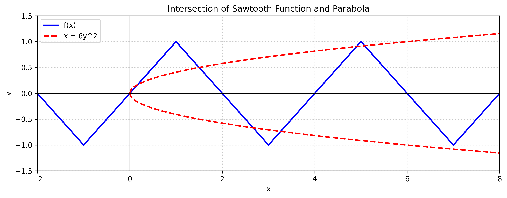

**🔑 답: `159.0`** &nbsp;|&nbsp; 🌱 시드: `K=6, M=None` &nbsp;|&nbsp; 🎨 테마: `Modeling and Intersection Analysis`

---

## 📌 P12 — Problem 12 — Geometry / Inequalities (3D Convex Regions)

- **주제:** Geometry / Algebra / 3D Convex Regions
- **난이도:** AIME Level 12

### 🔵 원형 문제 (Official AIME 2025 I)

> The set of points in 3-dimensional coordinate space that lie in the plane $x + y + z = 75$ whose coordinates satisfy the inequalities $x - yz < y - zx < z - xy$ forms three disjoint convex regions. Exactly one of those regions has finite area. The area of this finite region can be expressed in the form $a\sqrt{b}$, where $a$ and $b$ are positive integers and $b$ is not divisible by the square of any prime. Find $a + b$.

**🔑 공식 정답: `510`**

---

### 🟢 실전 변형 문제 (MOCK) (3개)

#### 실전 변형 1

> Consider points $(x, y, z)$ in three-dimensional coordinate space that lie on the plane defined by the equation $x + y + z = 63$. These points must also satisfy the inequality chain $x - yz < y - zx < z - xy$. This results in three disjoint convex regions, one of which has a finite area. Determine the finite area of this region and express it in the form $a\sqrt{b}$, where $b$ is squarefree. Find the value of $a + b$.

**🔑 답: `366`** &nbsp;|&nbsp; 🌱 시드: `{'N': 63, 'expected_t': 366}` &nbsp;|&nbsp; 🎨 테마: `AIME`

#### 실전 변형 2

> Consider the points $(x, y, z)$ in 3-dimensional coordinate space that lie on the plane defined by the equation $x + y + z = 99$. These coordinates also satisfy the inequality chain $x - yz < y - zx < z - xy$. This configuration forms three disjoint convex regions in space, of which exactly one has a finite area. Determine the area of this finite region, expressed in the form $a\sqrt{b}$, where $b$ is squarefree, and find the value of $a + b$.

**🔑 답: `870`** &nbsp;|&nbsp; 🌱 시드: `{'N': 99, 'expected_t': 870}` &nbsp;|&nbsp; 🎨 테마: `AIME`

#### 실전 변형 3

> Consider points $(x, y, z)$ in three-dimensional coordinate space that lie on the plane defined by the equation $x + y + z = 33$. These coordinates also satisfy the inequality chain $x - yz < y - zx < z - xy$. This setup results in three disjoint convex regions, one of which has a finite area. Determine the area of the finite region and express it in the form $a\sqrt{b}$, where $b$ is squarefree. Find the value of $a + b$.

**🔑 답: `111`** &nbsp;|&nbsp; 🌱 시드: `{'N': 33, 'expected_t': 111}` &nbsp;|&nbsp; 🎨 테마: `AIME`

### 🛠️ 개념 드릴 문제 (DRILL)

#### 드릴 Level 3

> Consider a structural engineer analyzing the stress zones of a triangular framework in a plane defined by the equation $x + y + z = 87$. The points $(x, y, z)$ within this plane must satisfy the inequalities $x - yz < y - zx < z - xy$. Determine the finite area formed by these constraints, express this area in the form $a\sqrt{b}$, and compute the sum $a + b$.

**🔑 답: `678.0`** &nbsp;|&nbsp; 🌱 시드: `{'N': 87, 'expected_t': 678, 'P1': [-1, -1, 89], 'P2': [29.0, 29.0, 29.0], 'drill_level': 3}` &nbsp;|&nbsp; 🎨 테마: `modeling`

#### 드릴 Level 3

> In a theoretical framework exploring subatomic force fields, consider the points in the three-dimensional space defined by the plane equation $x + y + z = 27$. These points must also satisfy the inequalities $x - yz < y - zx < z - xy$. Determine the finite area formed by the intersection of these constraints when projected onto the $xy$-plane. Express this area in the form $a\sqrt{b}$, where $a$ and $b$ are integers, and compute the sum $a + b$.

**🔑 답: `78.0`** &nbsp;|&nbsp; 🌱 시드: `{'N': 27, 'expected_t': 78, 'P1': [-1, -1, 29], 'P2': [9.0, 9.0, 9.0], 'drill_level': 3}` &nbsp;|&nbsp; 🎨 테마: `Modeling`

#### 드릴 Level 2

> Given the inequality $x - yz < y - zx$, it can be factored into the form $(x - y)(f(z)) < 0$. Identify the constant $c$ such that $f(z) = z - c$. What is the value of $c$?

**🔑 답: `-1.0`** &nbsp;|&nbsp; 🌱 시드: `{'N': 93, 'expected_t': -1.0, 'P1': [-1, -1, 95], 'P2': [31.0, 31.0, 31.0], 'drill_level': 2}` &nbsp;|&nbsp; 🎨 테마: `Algebraic Manipulation`

#### 드릴 Level 1

> Given the point in 3D space $(x, y, z) = (3, 1, 71)$, evaluate the expression $y - zx$.

**🔑 답: `-212.0`** &nbsp;|&nbsp; 🌱 시드: `{'N': 75, 'expected_t': -212.0, 'P1': [-1, -1, 77], 'P2': [25.0, 25.0, 25.0], 'drill_level': 1, 'target_point': [3, 1, 71]}` &nbsp;|&nbsp; 🎨 테마: `Direct evaluation`

#### 드릴 Level 3

> In an architectural design scenario, the stress zones of a triangular structure are modeled on the plane defined by the equation $x + y + z = 99$. The points $(x, y, z)$ within this plane must also satisfy the inequalities $x - yz < y - zx < z - xy$. Determine the area of the finite region formed by these constraints and express it in the form $a\sqrt{b}$. What is the value of $a + b$?

**🔑 답: `870.0`** &nbsp;|&nbsp; 🌱 시드: `{'N': 99, 'expected_t': 870, 'P1': [-1, -1, 101], 'P2': [33.0, 33.0, 33.0], 'drill_level': 3}` &nbsp;|&nbsp; 🎨 테마: `Modeling`

#### 드릴 Level 2

> Given the inequality $x - yz < y - zx$, factor it to the form $(x - y)(f(z)) < 0$. Determine the constant $c$ such that $f(z) = z - c$.

**🔑 답: `-1.0`** &nbsp;|&nbsp; 🌱 시드: `{'N': 57, 'expected_t': -1.0, 'P1': [-1, -1, 59], 'P2': [19.0, 19.0, 19.0], 'drill_level': 2}` &nbsp;|&nbsp; 🎨 테마: `Algebraic Manipulation`

#### 드릴 Level 1

> Given a point in 3D space $(x, y, z) = (0, -1, 4)$, evaluate the expression $yz - zx$.

**🔑 답: `-1.0`** &nbsp;|&nbsp; 🌱 시드: `{'N': 3, 'expected_t': -1.0, 'P1': [-1, -1, 5], 'P2': [1.0, 1.0, 1.0], 'drill_level': 1, 'target_point': [0, -1, 4]}` &nbsp;|&nbsp; 🎨 테마: `Direct Evaluation`

#### 드릴 Level 1

> Given the point in 3D space $(x, y, z) = (-1, -1, 65)$, evaluate the expression $y - zx$.

**🔑 답: `64.0`** &nbsp;|&nbsp; 🌱 시드: `{'N': 63, 'expected_t': 64.0, 'P1': [-1, -1, 65], 'P2': [21.0, 21.0, 21.0], 'drill_level': 1, 'target_point': [-1, -1, 65]}` &nbsp;|&nbsp; 🎨 테마: `Direct evaluation`

---

## 📌 P13 — Problem 13 — Combinatorics / Expected Value

- **주제:** Combinatorics / Geometric Probability / Expected Value
- **난이도:** AIME Level 13

### 🔵 원형 문제 (Official AIME 2025 I)

> Alex divides a disk into four quadrants with two perpendicular diameters intersecting at the center of the disk. He draws $10$ more line segments through the disk, drawing each segment by selecting two points at random on the perimeter of the disk in different quadrants and connecting these two points. Find the expected number of regions into which these $12$ line segments divide the disk.

**🔑 공식 정답: `167`**

---

### 🟢 실전 변형 문제 (MOCK) (3개)

#### 실전 변형 1

> In a laboratory conducting a study on cellular structures, a circular petri dish is divided into 20 equal sectors by 10 diameters. Researchers then draw 58 additional straight line segments through the dish, each with its two endpoints on the perimeter in DIFFERENT sectors. Thus, there are a total of 68 line segments. Find the expected number of regions created within the petri dish by these lines.

**🔑 답: `626`** &nbsp;|&nbsp; 🌱 시드: `m=10, n=58` &nbsp;|&nbsp; 🎨 테마: `Applied Mathematics`

#### 실전 변형 2

> A company is designing a new navigation system that uses a circular display to represent different flight paths. The display is divided into 14 equal sectors by 7 diameters. After establishing the primary routes, 22 additional straight line segments are drawn, each connecting two points on the perimeter of the display, ensuring that the endpoints are in different sectors. Calculate the expected number of regions into which these 29 lines divide the circular area.

**🔑 답: `109`** &nbsp;|&nbsp; 🌱 시드: `m=7, n=22` &nbsp;|&nbsp; 🎨 테마: `Real-world application`

#### 실전 변형 3

> In a scientific research lab studying the behavior of certain microorganisms, a circular petri dish is divided into 12 equal sectors using 6 diameters that intersect at the center. After the initial divisions, researchers introduce 42 additional straight line segments, each connecting two points on the perimeter of the dish that are located in different sectors. Determine the expected number of regions into which these 48 line segments divide the circular area.

**🔑 답: `344`** &nbsp;|&nbsp; 🌱 시드: `m=6, n=42` &nbsp;|&nbsp; 🎨 테마: `Real-world application`

### 🛠️ 개념 드릴 문제 (DRILL)

#### 드릴 Level 3

> A circular area is divided into 10 equal sectors by 5 diameters. Additionally, 17 chords are drawn such that each chord's endpoints lie in DIFFERENT sectors. In total, there are 22 line segments. Find the expected number of regions formed within the circle.

**🔑 답: `70.0`** &nbsp;|&nbsp; 🌱 시드: `m=5, n=17` &nbsp;|&nbsp; 🎨 테마: `Advanced`

#### 드릴 Level 2

> A circle is divided into 16 equal sectors by 8 diameters. Two chords are drawn such that their endpoints are chosen uniformly at random from the boundary, with the constraint that the two endpoints of EACH chord must lie in different sectors. Let $P$ be the probability that these two chords intersect. Calculate $3 \cdot 8^2 \cdot P$.

**🔑 답: `65.0`** &nbsp;|&nbsp; 🌱 시드: `m=8, n=48` &nbsp;|&nbsp; 🎨 테마: `Probability with Geometric Interpretation`

#### 드릴 Level 1

> A circular disk is partitioned by 8 distinct line segments. No two segments are parallel, and no three segments intersect at the same point. Determine the maximum number of regions into which the disk can be divided.

**🔑 답: `37.0`** &nbsp;|&nbsp; 🌱 시드: `m=6, n=40` &nbsp;|&nbsp; 🎨 테마: `Combinatorial Geometry`

#### 드릴 Level 3

> A circular area is divided into 24 equal sectors by 12 diameters. Additionally, 57 chords are drawn such that each chord's endpoints lie in DIFFERENT sectors. In total, there are 69 line segments. Find the expected number of regions formed within the circle.

**🔑 답: `606.0`** &nbsp;|&nbsp; 🌱 시드: `m=12, n=57` &nbsp;|&nbsp; 🎨 테마: `Expected Value`

#### 드릴 Level 2

> A circle is divided into 30 equal sectors by 15 diameters. Two chords are drawn such that their endpoints are chosen uniformly at random from the boundary, with the constraint that the two endpoints of EACH chord must lie in different sectors. Let $P$ be the probability that these two chords intersect. Calculate $3 \cdot 15^2 \cdot P$.

**🔑 답: `226.0`** &nbsp;|&nbsp; 🌱 시드: `m=15, n=10` &nbsp;|&nbsp; 🎨 테마: `Probability`

#### 드릴 Level 1

> A circular disk is partitioned by 12 distinct line segments. No two segments are parallel, and no three segments intersect at the same point. Determine the maximum number of regions into which the disk can be divided.

**🔑 답: `79.0`** &nbsp;|&nbsp; 🌱 시드: `m=15, n=51` &nbsp;|&nbsp; 🎨 테마: `Counting Regions`

#### 드릴 Level 3

> A circular area is divided into 10 equal sectors by 5 diameters. Additionally, 49 chords are drawn such that each chord's endpoints lie in different sectors. In total, there are 54 line segments. Find the expected number of regions formed within the circle.

**🔑 답: `463.0`** &nbsp;|&nbsp; 🌱 시드: `m=5, n=49` &nbsp;|&nbsp; 🎨 테마: `Expected Value`

#### 드릴 Level 2

> A circle is divided into 8 equal sectors by 4 diameters. Two chords are drawn such that their endpoints are chosen uniformly at random from the boundary, with the constraint that the two endpoints of EACH chord must lie in different sectors. Let $P$ be the probability that these two chords intersect. Calculate $3 \cdot 4^2 \cdot P$.

**🔑 답: `17.0`** &nbsp;|&nbsp; 🌱 시드: `m=4, n=59` &nbsp;|&nbsp; 🎨 테마: `Probability`

#### 드릴 Level 1

> A circular disk is partitioned by 7 distinct line segments. No two segments are parallel, and no three segments intersect at the same point. Find the maximum number of regions the disk is divided into.

**🔑 답: `29.0`** &nbsp;|&nbsp; 🌱 시드: `m=1, n=16` &nbsp;|&nbsp; 🎨 테마: `Counting Regions in Geometry`

#### 드릴 Level 3

> In a circular area divided into 14 equal sectors by 7 diameters, 31 chords are drawn such that each chord's endpoints lie in different sectors. Calculate the expected number of regions formed within the circle as a result of these 38 line segments.

**🔑 답: `197.0`** &nbsp;|&nbsp; 🌱 시드: `m=7, n=31` &nbsp;|&nbsp; 🎨 테마: `Expected Value`

---

## 📌 P14 — Problem 14 — Geometry (Fermat Point)

- **주제:** Geometry / Fermat Point / Distance Optimization
- **난이도:** AIME Level 14

### 🔵 원형 문제 (Official AIME 2025 I)

> Let $ABCDE$ be a convex pentagon with $AB = 14$, $BC = 7$, $CD = 24$, $DE = 13$, $EA = 26$, and $\angle B = \angle E = 60^\circ$. For each point $X$ in the plane, define $f(X) = AX + BX + CX + DX + EX$. The least possible value of $f(X)$ can be expressed as $m + n\sqrt{p}$, where $m$ and $n$ are positive integers and $p$ is not divisible by the square of any prime. Find $m + n + p$.

**🔑 공식 정답: `593`**

---

### 🟢 실전 변형 문제 (MOCK) (3개)

#### 실전 변형 1

> Let $ABCDE$ be a convex pentagon such that $AB=56, BC=28, CD=96, DE=52, EA=104$ and $\angle B = \angle E = 60^\circ$. Let $X$ be a point in the interior of the pentagon. The minimum possible value of the sum of distances $AX+BX+CX+DX+EX$ can be expressed in the form $m + n\sqrt{p}$, where $m, n, p$ are positive integers and $p$ is not divisible by the square of any prime. Find the value of $m + n + p$.

**🔑 답: `179`** &nbsp;|&nbsp; 🌱 시드: `k1=28, k2=52, CD=96` &nbsp;|&nbsp; 🎨 테마: `Geometric Optimization`

#### 실전 변형 2

> Let $ABCDE$ be a convex pentagon such that $AB=152, BC=76, CD=192, DE=148, EA=296$ and $\angle B = \angle E = 60^\circ$. Let $X$ be a point in the interior of the pentagon. The minimum possible value of the sum of distances $AX+BX+CX+DX+EX$ can be expressed in the form $m + n\sqrt{p}$, where $m, n, p$ are positive integers and $p$ is not divisible by the square of any prime. Find the value of $m + n + p$.

**🔑 답: `419`** &nbsp;|&nbsp; 🌱 시드: `k1=76, k2=148, CD=192` &nbsp;|&nbsp; 🎨 테마: `AIME`

#### 실전 변형 3

> Let $ABCDE$ be a convex pentagon such that $AB=70, BC=35, CD=120, DE=65, EA=130$ and $\angle B = \angle E = 60^\circ$. Let $X$ be a point in the interior of the pentagon. The minimum possible value of the sum of distances $AX+BX+CX+DX+EX$ can be expressed in the form $m + n\sqrt{p}$, where $m, n, p$ are positive integers and $p$ is not divisible by the square of any prime. Find the value of $m + n + p$.

**🔑 답: `223`** &nbsp;|&nbsp; 🌱 시드: `k1=35, k2=65, CD=120` &nbsp;|&nbsp; 🎨 테마: `Constructive`

### 🛠️ 개념 드릴 문제 (DRILL)

#### 드릴 Level 3

> Consider a convex pentagon $ABCDE$ with sides $AB = 152$, $BC = 76$, $CD = 192$, $DE = 148$, and $EA = 296$. Angles $\angle B$ and $\angle E$ are both $60^{\circ}$. Determine the maximum possible area of pentagon $ABCDE$.

**🔑 답: `419.0`** &nbsp;|&nbsp; 🌱 시드: `k1=76, k2=148, CD=192` &nbsp;|&nbsp; 🎨 테마: `Optimization`

#### 드릴 Level 2

> Consider a rhombus with diagonals of lengths 24 and 13. Let points $A$, $B$, $C$, and $D$ be the vertices of the rhombus, and let point $X$ be a point inside the rhombus. Define the distances from point $X$ to the vertices as $AX$, $BX$, $CX$, and $DX$. What is the minimum value of the sum $AX + BX + CX + DX$?

**🔑 답: `37.0`** &nbsp;|&nbsp; 🌱 시드: `{'diag1': 24, 'diag2': 13, 'expected_t': 37.0, 'drill_level': 2}` &nbsp;|&nbsp; 🎨 테마: `Geometric Optimization`

#### 드릴 Level 3

> In pentagon $ABCDE$, the lengths of the sides are given as $AB = 340$, $BC = 170$, $CD = 525$, $DE = 250$, and $EA = 500$. The angles $	heta_B$ and $	heta_E$ are both $60^	ext{o}$. Determine the maximum possible area of pentagon $ABCDE$.

**🔑 답: `948.0`** &nbsp;|&nbsp; 🌱 시드: `k1=170, k2=250, CD=525` &nbsp;|&nbsp; 🎨 테마: `Optimization`

#### 드릴 Level 2

> Let $A$, $B$, $C$, and $D$ be the vertices of a rhombus whose diagonals measure $34$ and $17$. If $X$ is a point inside the rhombus, find the minimum value of the expression $AX + BX + CX + DX$.

**🔑 답: `51.0`** &nbsp;|&nbsp; 🌱 시드: `{'diag1': 34, 'diag2': 17, 'expected_t': 51.0, 'drill_level': 2}` &nbsp;|&nbsp; 🎨 테마: `Minimization`

#### 드릴 Level 1

> In triangle $ABC$, let $P$ be the Fermat point of the triangle. The angles $	heta_A$, $	heta_B$, and $	heta_C$ denote the angles $	riangle APB$, $	riangle BPC$, and $	riangle CPA$, respectively. If the measure of angle $AXB$ is defined as the angle formed between the segments $AP$ and $BP$, what is the measure of angle $AXB$ in degrees?

**🔑 답: `120.0`** &nbsp;|&nbsp; 🌱 시드: `{'side': 12, 'expected_t': 120.0, 'drill_level': 1}` &nbsp;|&nbsp; 🎨 테마: `Configuration and angles`

#### 드릴 Level 3

> In a pentagon $ABCDE$, the lengths of the sides are given by $AB = 34$, $BC = 17$, $CD = 51$, $DE = 17$, and $EA = 34$. The angles at vertices $B$ and $E$ are both $60^	ext{o}$. What is the area of pentagon $ABCDE$?

**🔑 답: `88.0`** &nbsp;|&nbsp; 🌱 시드: `k1=17, k2=17, CD=51` &nbsp;|&nbsp; 🎨 테마: `Optimization`

#### 드릴 Level 2

> Let a rhombus have diagonals of lengths 46 and 20. Determine the minimum value of the expression $AX + BX + CX + DX$, where $A$, $B$, $C$, and $D$ are the vertices of the rhombus, and $X$ is a point inside the rhombus.

**🔑 답: `66.0`** &nbsp;|&nbsp; 🌱 시드: `{'diag1': 46, 'diag2': 20, 'expected_t': 66.0, 'drill_level': 2}` &nbsp;|&nbsp; 🎨 테마: `Minimization`

#### 드릴 Level 1

> In triangle $ABC$, let $P$ be the Fermat point, such that each angle $APB$, $BPC$, and $CPA$ measures $120^{	ext{o}}$. If $X$ is the point where the line segment $AP$ intersects the side $BC$, what is the measure of angle $AXB$?

**🔑 답: `120.0`** &nbsp;|&nbsp; 🌱 시드: `{'side': 20, 'expected_t': 120.0, 'drill_level': 1}` &nbsp;|&nbsp; 🎨 테마: `Configuration Problem`

#### 드릴 Level 3

> In pentagon ABCDE, the side lengths are given as follows: $AB = 210$, $BC = 105$, $CD = 360$, $DE = 195$, and $EA = 390$. The angles at vertices $B$ and $E$ are both $60^{	ext{o}}$. Determine the area of pentagon ABCDE.

**🔑 답: `663.0`** &nbsp;|&nbsp; 🌱 시드: `k1=105, k2=195, CD=360` &nbsp;|&nbsp; 🎨 테마: `Construction and optimization`

#### 드릴 Level 2

> Given a rhombus with diagonals of lengths 14 and 17, let $A$, $B$, $C$, D be the vertices of the rhombus. If $X$ is a point inside the rhombus, find the minimum value of the sum $AX + BX + CX + DX$.

**🔑 답: `31.0`** &nbsp;|&nbsp; 🌱 시드: `{'diag1': 14, 'diag2': 17, 'expected_t': 31.0, 'drill_level': 2}` &nbsp;|&nbsp; 🎨 테마: `Minimization`

---

## 📌 P15 — Problem 15 — Number Theory (LTE / Modular Arithmetic)

- **주제:** Number Theory / Lifting the Exponent Lemma
- **난이도:** AIME Level 15

### 🔵 원형 문제 (Official AIME 2025 I)

> Let $N$ denote the number of ordered triples of positive integers $(a, b, c)$ such that $a, b, c \leq 3^7$ and $a^3 + b^3 + c^3$ is a multiple of $3^7$. Find the remainder when $N$ is divided by $1000$.

**🔑 공식 정답: `247`**

---

### 🟢 실전 변형 문제 (MOCK) (3개)

#### 실전 변형 1

> Let $N$ be the number of ordered triples $(a, b, c)$ of positive integers such that $a, b, c \le 3^{6}$ and $a^3 + b^3 + c^3 \equiv 0 \pmod{ 3^{7} }. Find the remainder when $N$ is divided by 1000.

**🔑 답: `735`** &nbsp;|&nbsp; 🌱 시드: `K=6, M=7` &nbsp;|&nbsp; 🎨 테마: `Pure Math`

#### 실전 변형 2

> Find the remainder when the number of positive integer solutions $(a, b, c, k)$ to the equation $a^3 + b^3 + c^3 = 3^{5} \cdot k$, subject to the condition $\max(a, b, c) \le 3^{7}$, is divided by 1000.

**🔑 답: `791`** &nbsp;|&nbsp; 🌱 시드: `K=7, M=5` &nbsp;|&nbsp; 🎨 테마: `Style 3 (Equation)`

#### 실전 변형 3

> Define the set $A = \{1, 2, \dots, 3^{7}\}.$ Let $S$ be the subset of $A \times A \times A$ consisting of elements $(a, b, c)$ for which $a^3 + b^3 + c^3$ is a multiple of $3^{8}$. Determine the remainder when the size of set $S$ is divided by 1000.

**🔑 답: `379`** &nbsp;|&nbsp; 🌱 시드: `K=7, M=8` &nbsp;|&nbsp; 🎨 테마: `Set Theory`

### 🛠️ 개념 드릴 문제 (DRILL)

#### 드릴 Level 3

> Find the number of ordered triples \((a, b, c)\) such that \(a^3 + b^3 + c^3 \equiv 0 \pmod{3^3}\) where \(0 \leq a, b, c \leq 3^4\).

**🔑 답: `49.0`** &nbsp;|&nbsp; 🌱 시드: `K=4, M=3` &nbsp;|&nbsp; 🎨 테마: `Modular Arithmetic`

#### 드릴 Level 2

> Find the number of ordered pairs $(a, b)$ with $a, b \in \{1, \dots, 81\}$ such that $a^3 + b^3 \equiv 0 \pmod{81}$.

**🔑 답: `2187.0`** &nbsp;|&nbsp; 🌱 시드: `{'m_mod': 81, 'expected_t': 2187.0, 'drill_level': 2}` &nbsp;|&nbsp; 🎨 테마: `Count pairs satisfying a modular condition`

#### 드릴 Level 1

> Find the number of integers $a \in \{1, 2, \dots, 243\}$ such that $a^3 \equiv 1 \pmod{243}$.

**🔑 답: `81.0`** &nbsp;|&nbsp; 🌱 시드: `{'m_mod': 243, 'expected_t': 81.0, 'drill_level': 1}` &nbsp;|&nbsp; 🎨 테마: `Counting Solutions`

#### 드릴 Level 3

> Find the number of ordered triples of integers \( (a, b, c) \) such that \( a^3 + b^3 + c^3 \equiv 0 \pmod{3^{8}} \) and \( 0 \leq a, b, c \leq 3^{5} \).

**🔑 답: `851.0`** &nbsp;|&nbsp; 🌱 시드: `K=5, M=8` &nbsp;|&nbsp; 🎨 테마: `Modular Arithmetic`

#### 드릴 Level 2

> Find the number of ordered pairs $(a, b)$ with $a, b \in \{1, \dots, 9\}$ such that $a^3 + b^3 \equiv 0 \pmod{9}$.

**🔑 답: `27.0`** &nbsp;|&nbsp; 🌱 시드: `{'m_mod': 9, 'expected_t': 27.0, 'drill_level': 2}` &nbsp;|&nbsp; 🎨 테마: `Counting Ordered Pairs`

#### 드릴 Level 1

> Find the number of integers $a \in \{1, 2, \dots, 81\}$ such that $a^3 \equiv 1 \pmod{81}$.

**🔑 답: `27.0`** &nbsp;|&nbsp; 🌱 시드: `{'m_mod': 81, 'expected_t': 27.0, 'drill_level': 1}` &nbsp;|&nbsp; 🎨 테마: `Congruences`

#### 드릴 Level 3

> Find the number of ordered triples \((a, b, c)\) of integers such that \(a^3 + b^3 + c^3 \equiv 0 \pmod{3^{4}}\) where \(0 \leq a, b, c \leq 3^{5}\).

**🔑 답: `441.0`** &nbsp;|&nbsp; 🌱 시드: `K=5, M=4` &nbsp;|&nbsp; 🎨 테마: `Modular Arithmetic`

#### 드릴 Level 2

> Find the number of ordered pairs $(a, b)$ with $a, b \in \{1, \dots, 9\}$ such that $a^3 + b^3 \equiv 0 \pmod{9}$.

**🔑 답: `27.0`** &nbsp;|&nbsp; 🌱 시드: `{'m_mod': 9, 'expected_t': 27.0, 'drill_level': 2}` &nbsp;|&nbsp; 🎨 테마: `Counting`

#### 드릴 Level 1

> Find the number of integers $a \in \{1, 2, \dots, 243\}$ such that $a^3 \equiv 1 \pmod{243}$.

**🔑 답: `81.0`** &nbsp;|&nbsp; 🌱 시드: `{'m_mod': 243, 'expected_t': 81.0, 'drill_level': 1}` &nbsp;|&nbsp; 🎨 테마: `Count integers satisfying modular equations`

---

## 📊 전체 비교 요약

| 문항 | 유형 | 원형 정답 | 변형 정답 목록 | 생성 수 |
|------|------|-----------|----------------|--------|
| P01 | Number Theory | `70` | [44, 61, 193, 115, 27, 126, 32, 72, 142, 106, 27, 86, 47] | 13개 |
| P10 | Combinatorics | `81` | [292, 7, 744, 680, 460800, 948109639680, 460800, 948109639680, 460800, 948109639680, 12, 12, 12] | 13개 |
| P11 | Algebra | `259` | [259, 801, 578, 801, 60, 1, 801, 60, 2, 225, 60, -1, 159] | 13개 |
| P12 | Geometry | `510` | [366, 870, 111, 678, 78, -1, -212, 870, -1, -1, 64] | 11개 |
| P13 | Combinatorics | `167` | [626, 109, 344, 70, 65, 37, 606, 226, 79, 463, 17, 29, 197] | 13개 |
| P14 | Geometry | `593` | [179, 419, 223, 419, 37, 948, 51, 120, 88, 66, 120, 663, 31] | 13개 |
| P15 | Number Theory | `247` | [735, 791, 379, 49, 2187, 81, 851, 27, 27, 441, 27, 81] | 12개 |

---

*이 리포트는 `amc_engine/export_comparison.py`에 의해 자동 생성되었습니다.*
