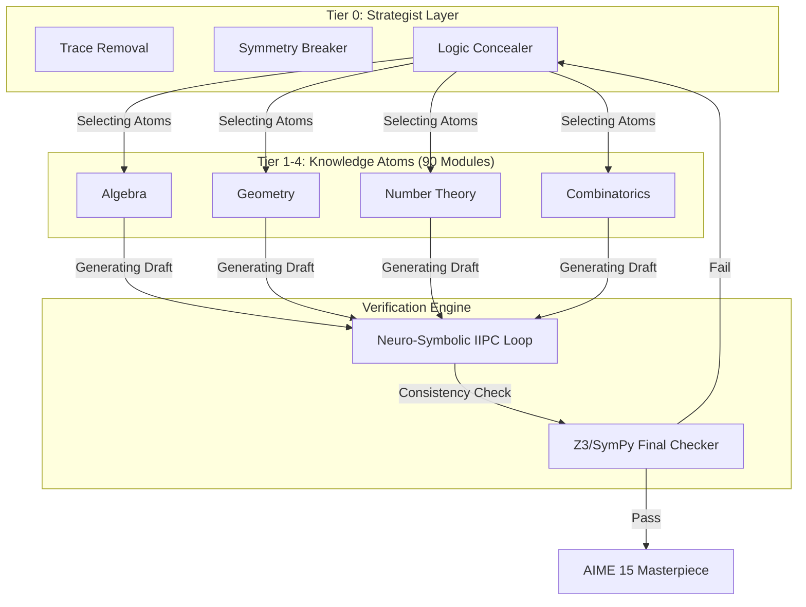

# AIME Engine V2: From Specific Solving to Systemic Synthesis

> **Technical Migration Report: Expanding the Frontiers of AI Mathematical Reasoning**

---

## [ENGLISH VERSION]

## 1. Executive Summary
The **V2 (Heritage 90)** architecture represents a paradigm shift in the AI_MathMate project. We have evolved from a **'Task-Specific Solver' (V1)**—which mapped individual AIME problems to 1:1 procedural scripts—to an **'Atomic Generation MAS (V2)'** capable of autonomously designing and synthesizing high-rigor mathematical problems (AIME 1-15).

This report details the technical journey of capturing the "Author's Mental Model" and operationalizing it into a neuro-symbolic framework.

## 2. Architecture Evolution

### 2.1. V1: The Specialist Phase (Specific Solver)
V1 was optimized for deterministic accuracy against known datasets (e.g., AIME 2025).

*   **Logic Model**: 1 Problem ↔ 1 Solver (Case-by-case procedural scripts)
*   **Strengths**: 100% deterministic accuracy for fixed scenarios.
*   **Bottlenecks**:
    *   **Zero Scalability**: Required manual coding for every new problem type.
    *   **Determinism Trap**: Limited to numerical variations; incapable of structural innovation.
    *   **Logic Entanglement**: Math principles were tightly coupled with problem-specific heuristics.

### 2.2. V2: The Heritage 90 Framework (Generative MAS)
V2 deconstructs 1,000+ AIME problems into **90 Knowledge Atoms**. These atoms are orchestrated by a **Strategist Tier (Tier 0)** to synthesize novel challenges via a Multi-Agent System.

## 3. Core Technical Innovations

### 3.1. DAPS (Dynamic Difficulty Scoring)
We moved from intuitive difficulty labeling to a quantitative complexity model.
$$DAPS = \sum_{i=1}^{n} (Complexity_{Base} \times LogicDepth_{i}) + \delta(Heuristic)$$
*   **Multi-Leap Points**: By calculating the logical gap between atom junctions, the engine can precisely target the AIME 13-15 "Killer" difficulty band.

### 3.2. IIPC (Iteratively Improved Program Construction)
A **Neuro-Symbolic Loop** designed to eliminate LLM hallucinations:
1.  **Draft Generate**: Strategist agents propose a problem narrative.
2.  **Symbolic Extract**: The logic is automatically parsed into target-agnostic Python code.
3.  **Solver Execution**: Deterministic execution verifies answer integrity (001-999).
4.  **Reflection**: Failures trigger an agentic feedback loop to refine the narrative until symbolic consistency is reached.

## 4. Case Study: P11 Masterpiece Build

| Category | V1 (Fixed Solver) | V2 (Heritage 90 Build) |
| :--- | :--- | :--- |
| **Logic** | Fixed 2025 AIME1 P11 Script | Periodicity(Atom #11) + Intersection(Atom #36) |
| **Asymmetry** | Standard Constants | **Symmetry Breaker** injected asymmetric pivots |
| **Concealment** | None | **Trace-Removal** masked geometric scaffolding |
| **Output** | Reproduces 기출 | **Generates infinite novel variants** |

---

## [KOREAN VERSION]

## 1. 개요 (Executive Summary)
**V2 (Heritage 90)** 아키텍처는 AI_MathMate 프로젝트의 2단계 진화로, 특정 문항에 1:1로 대응하던 **'Task-Specific Solver' (V1)** 체계를 넘어, 고난도 수학 문항(AIME 1~15번)을 자율적으로 설계 및 합성하는 **'Atomic Generation MAS (V2)'**로의 전면적인 고도화를 달성했습니다.

## 2. 아키텍처의 진화

### 2.1. V1: 전문가 단계 (특정 솔버)
V1은 2025 AIME 기출 등 고도로 정교한 특정 태스크 해결에 최적화되었습니다.
*   **수학적 한계**: 입도(Granularity)가 낮아 새로운 유형 등장 시 수동 코드 구현이 불가피했으며, 창의적인 문항 변주가 불가능했습니다.

### 2.2. V2: Heritage 90 프레임워크 (생성형 MAS)
기출 1,000개를 원자 단위로 해체하여 얻은 **90종의 원자 모듈**을 전략 계층이 지휘하는 다중 에이전트 시스템입니다. (위의 Mermaid 다이어그램 참조)

## 3. 핵심 기술 혁신

### 3.1. DAPS (Dynamic Difficulty Scoring)
난이도를 수치적 결합도로 측정하여 AIME 13-15번을 정교하게 타겟팅합니다.
### 3.2. IIPC (Iteratively Improved Program Construction)
LLM의 환각(Hallucination)을 방지하기 위한 **신경-기호(Neuro-Symbolic) 루프**로, 지문 생성과 심볼릭 코드 실행을 일치시킵니다.

## 4. 결론 (Conclusion)
V2는 단순히 수학 문제를 푸는 도구를 넘어, 출제 위원의 아키텍처를 알고리즘화하여 **'지능의 합성'**을 달성한 결과물입니다.

---

**Designed by Siyoul Jung**
*AIME Engine V2 Architect*
